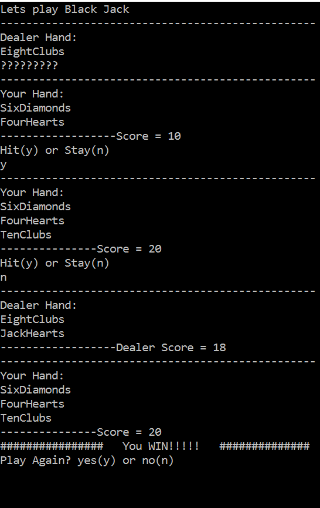
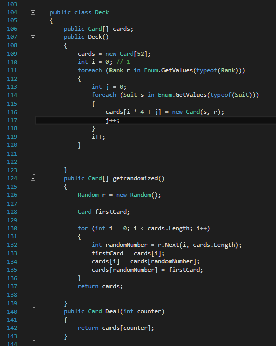
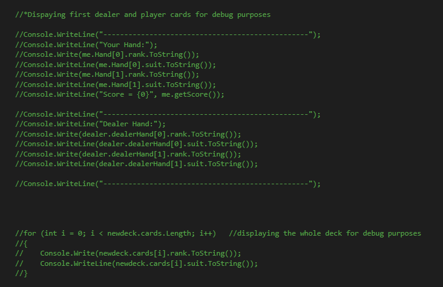

# BlackJack
###Technologies, Frameworks and Programming Languages:
C# ASP.NET

###Overview of Project:
- A console application implementation of Black Jack. It functions as a single player game against a computer controlled dealer. 

### To Play
- The player uses the "y" key to hit and "n" key to stay.

- After each round the player has the option of playing another hand or exiting the game. 

- The game has functionality for tracking the scores a displaying a winner after each round.

###Challenges Faced & Solutions Used: 
The major challenge faced early on in this application was how create and shuffle a deck of cards. Ultimately, I created a class structure for cards and a deck, using enums for the rank and suits. As a deck was an array of cards I implemented a sorting algorithm to iterate through the array and randomly shuffle the deck. 

###Error Handling and Troubleshooting:
With one of my biggest challenges being the initial setup of the cards, the deck, and shuffling I needed to make sure I had a way to test those functions before I got into the game mechanics. For this I built out a series of functions to print the unshuffled and shuffled decks to debug effectively. 

###Future Updates
- Building multiplayer functionality with both additional players and computers.
 - The addition of a betting function.
 - Allowing the game to track chip totals after several rounds.
 - I see this game as being a great platform to experiment with functional programming and hope to update the code base in the future. 

